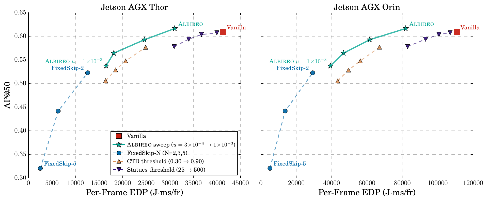
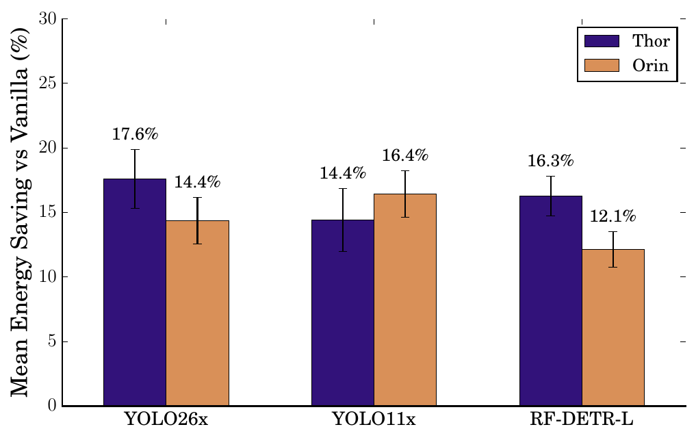

# Albireo — Adaptive, Energy-Efficient Video Object Detection on the Edge

[](LICENSE)
[](https://acm-ieee-sec.org/2026/)


Albireo is named after a visually contrasting binary star system: the
brighter component stands for full detector inference, the dimmer
companion for lightweight Kalman prediction — the two execution modes the
system alternates between.

Albireo is a detector-agnostic, codec-free frame-skipping system: it wraps an
off-the-shelf object detector and decides, per frame, whether detector
invocation can be safely skipped. A per-object Kalman filter supplies a
forward-looking uncertainty trigger, a rescue mechanism preserves confirmed
objects through brief detector misses, and a lightweight empty-scene screen
handles objectless stretches. No detector modification or retraining is
required.

On BDD100K MOT across three detectors (YOLO11x, YOLO26x, RF-DETR-Large) and
two NVIDIA Jetson generations (AGX Orin, AGX Thor), Albireo keeps AP@50
within ±1.2 pp of per-frame inference while reducing energy by 12.1–17.6%.
At the default operating point on YOLO26x it improves AP@50, energy, and
latency simultaneously.

> **Paper**: *Albireo: Adaptive, Energy-Efficient Inference Framework for
> Video Object Detection on the Edge.* Amir Taherin, José Cano, Bin Ren,
> Yanzhi Wang, David Kaeli. ACM/IEEE Symposium on Edge Computing (SEC), 2026.

> **Status**: camera-ready artifact. Full release is being finalized for the
> conference (October 2026); interfaces may still move.

## Results at a glance

At the default operating point (star, `u=3e-4`), Albireo's threshold sweep
forms the upper AP@50–EDP Pareto frontier over the evaluated frame-skipping
baselines, and the default point improves accuracy, energy, and latency
simultaneously over per-frame inference:

<p align="center">
  
</p>

Energy savings hold across three detector architectures and both Jetson
generations while AP@50 stays within ±1.2 pp of per-frame inference:

<p align="center">
  
</p>

## Repository layout

| Path | Contents |
|---|---|
| `albireo/` | The system: adaptive tracker (`AdaptiveTracker`), tuned defaults |
| `baselines/` | Vanilla, FixedSkip-N, CTD, Statues, ERD-only reimplementations |
| `telemetry/` | Jetson tegrastats capture + parsers, per-clip power monitor |
| `experiments/` | BDD100K evaluation runner, Jetson sweep scripts, power-mode runs |
| `erd_finetune/` | Empty-scene classifier fine-tuning + weights (see attribution) |
| `results/` | Per-clip `summary.csv` sets behind every paper table/figure |
| `figures/` | Scripts that generate the paper figures from `results/` |
| `docs/` | Full frame-state machine diagram (all 15 transitions) |
| `data/` | BDD100K download instructions + the exact 200-clip list (seed 42) |

## Quick start (Jetson)

```bash
pip install -r requirements.txt         # plus ultralytics / rfdetr for detectors
# download BDD100K MOT val (see data/README.md), then:
cd experiments
python3 run_experiment.py \
    --bdd-root ~/bdd100k --model yolo26x \
    --platform orin --num-clips 5 --seed 42 \
    --yolo-conf 0.50 --mode vanilla+adaptive
```

Full-corpus runs, baselines, threshold sweeps, and power-mode experiments are
scripted under `experiments/scripts/` and `experiments/power_modes/`.

## Reproducing the paper

Every table and figure derives from `results/**/summary.csv`; see
`results/README.md` for the mapping and `figures/` for the plotting scripts.
Energy/power columns are collected via `telemetry/` (tegrastats at 100 ms).

## License

MIT (see `LICENSE`). The ERD classifier builds on Liu & Kang's MIT-licensed
implementation — see `erd_finetune/README.md` for attribution.
